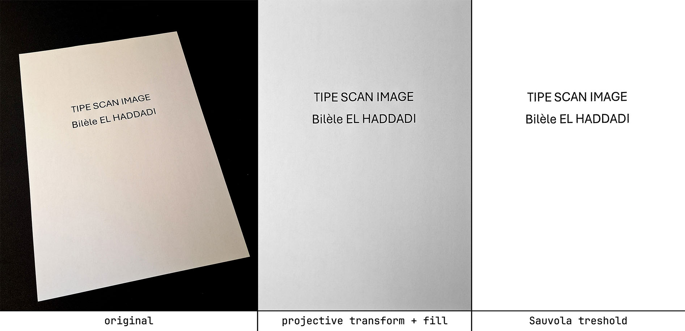

# Document Scanner from Scratch
*A pure Python document scanner using only NumPy, Numba (to speed up execution) developed from scratch for academic purposes.*

<mui:table-metadata title="Badges" />

| CI/CD | Python | License |
|-------|--------|---------|
|  |  |  |

---

## Overview
This project is a **document scanner** built **from scratch** in Python.

It was developed as part of my TIPE (Personal Initiative Project) in engineering school.
The goal was to build a project entirely by ourself, without relying on high-level libraries.
This approach allowed me to deeply understand the underlying algorithms—from edge detection to perspective
correction—and implement them step by step.
It's a testament to learning by doing and the value of reinventing the wheel for educational purposes.


**Goal:** Archieve an automatic scan of a document. Document will be straightened and binarized in dark and white.

---

## Features
<mui:table-metadata title="Key Features" />

| Feature                    | Description                                           |
|----------------------------|-------------------------------------------------------|
| **Corner Detection**       | Canny Edge detection                                  |
| **Perspective Correction** | Homographic transformation to straighten the document |
| **Binarization**           | Convert to black and white using local thresholding   |
| **Export**                 | Save as PNG (matplotlib)                              |

Here is an example of each step of the process done automatically.

---

## Installation
### Prerequisites
- Python 3.8+
- Jupyter Notebook
- Matplotlib
- NumPy
- Pil (import image only)
- Numba (optional)

### Installation Steps
```bash
git clone https://github.com/TooLoss/PythonDocumentScanFromScratch.git
cd PythonDocumentScanFromScratch
pip install -r requirements.txt
```

---

## Usage

Every steps are details in the [main](main.ipynb) notebook.

---

## Methodology
### 1. Corner Detection
- Sobel filters to detect edges.
- Hadamar product and Connected Component Labeling to find corners.

### 2. Perspective Correction
- Calculate homographic transformation using the detected corners.
- Apply transformation and fill unaffected values with a nearest neighbors algorithm.

### 3. Binarization
- Local tresholding implementation : Sauvola and Niblack.

---

## Results and limits
<mui:table-metadata title="Performance Metrics" />

The process works best if it's a black and white text document.
With a high contrast between the page and the background.

| Metric                                       | Value           |
|----------------------------------------------|-----------------|
| Detection Accuracy (with default parameters) | Testing ...     |
| Execution Time : Projective transofrm        | 12s per image   |
| Execution Time : Tresholding                 | 1m per image 💀 |

<!--
**📷 Insert here:**
- Graph or comparison table (e.g., `results_comparison.png`).
-->

---

## Contributing
Contributions are welcome! Open an **Issue** or a **Pull Request** to suggest improvements.

---

## License
This project is licensed under the **MIT License**. See [LICENSE](LICENSE) for details.

---

## Contact
Bilèle EL HADDADI

[LinkedIn](https://www.linkedin.com/in/bilele-elhaddadi/) | [GitHub](https://github.com/TooLoss)

---
*© 2025 – Project developed as part of the TIPE.*
